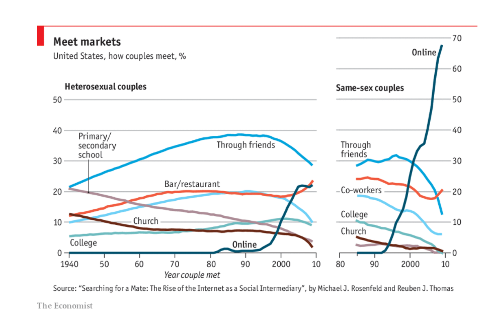

```{r setup, include=FALSE}
# chunk options
options(scipen = 13)
knitr::opts_chunk$set(
  message = FALSE,
  warning = FALSE,
  fig.align = "center",
  comment = "#>"
)
```

# Introduction
Welcome to the Rplicate Series! In this article we will try to replicate the plot from The Economist article, [The irresistible rise of internet dating](https://www.economist.com/graphic-detail/2018/08/17/the-irresistible-rise-of-internet-dating). The graph is based on Rosenfeld's (2012) study on [how couples meet and stay together](https://data.stanford.edu/hcmst#download-data) published in an article entitled [Searching for a Mate: The Rise of the Internet as a Social Intermediary](https://journals.sagepub.com/doi/full/10.1177/0003122412448050). This article will cover how to change the value of axes, making arrow to highlight information on our plot, and set multiple row on our title. 

```{r echo=FALSE, out.width = "800px"}

```

## Load Packages
Below is the required packages for data wrangling and visualization.
```{r library, message=FALSE, warning=FALSE}
library(extrafont)
library(haven)
library(foreign)
library(lubridate) 
library(dplyr)
library(ggplot2)
library(reshape2)
library(tidyr)
library(ggthemes)
library(ggrepel)
library(png)
library(grid)
library(gridExtra)
```

## Load Fonts
We use Officina Sans based on [ggthemes package documentary](https://mran.microsoft.com/snapshot/2015-01-14/web/packages/ggthemes/ggthemes.pdf) regarding the economist theme.
```{r font, message=FALSE, warning=FALSE}
custom_font_family <- "ITC Officina Sans"
```


# Data Collection
Dataset is taken from [data.stanford.edu](https://data.stanford.edu/hcmst#download-data) with SPSS format.
```{r}
data <- read_sav('data_input/HCMST_ver_3.04.sav')
head(data)
```
```{r}
str(data, list.len = 3)
```

```{r}
dim(data)
```
The dataset consist of 4002 observations and 387 variables. There are 3009 of 4002 participants of How Couples Met and Stay Together main survey based on the [Brief Guide](https://stacks.stanford.edu/file/druid:ns183dp7831/HCMST_brief_user_guide_v5_June_16_2015.htm). The remaining 993 respondents did not have a spouse or partner at the time of the main survey. This information can be derived from `qflag` variables. 


```{r}
unique(data$qflag)
```
For further data wrangling, it's easier if we use the data in dataframe format and drop the SPSS labels. We do this by using `read.spss` function in [foreign](https://cran.r-project.org/web/packages/foreign/index.html) library.
```{r message=FALSE, warning=FALSE}
data <- read.spss('data_input/HCMST_ver_3.04.sav', to.data.frame = TRUE,
                    use.value.labels = FALSE)
head(data)[1:5,1:7]
```

# Data Wrangling
The graph was plotting the year couple met and where did they meet. The dataset doesn't have the variable that enlists what year the respondent and their couple met, but instead, they ask how long ago the respondent met their partner in years. We can get `year_couple_met` by subtracting `how_long_ago_first_met` variable with `HCMST_main_interview_yrmo` variable. See example below:
```{r}
ym(data$HCMST_main_interview_yrmo)[1] - years(data$how_long_ago_first_met)[1]
```
The survey documented places where couples met on q24_* variables. Don't forget that the graph is divided by whether the couple was heterosexual or not, so we also need to take the `same_sex_couple` variable. We can do all of this by piping with the [dplyr](https://dplyr.tidyverse.org/) package.

```{r}
data_hcmst <- data %>% 
  filter(qflag == 1) %>% 
  select(c("HCMST_main_interview_yrmo", 
         "how_long_ago_first_met",
         "same_sex_couple",
         "q24_met_online",
         "q24_school" ,                     
         "q24_college",
         "q24_church",
         "q24_bar_restaurant",
         "q24_R_cowork",
         "met_through_friends"
         )) %>% 
  mutate(HCMST_main_interview_yrmo = ym(HCMST_main_interview_yrmo)) %>% 
  mutate(year_couple_met = HCMST_main_interview_yrmo - years(how_long_ago_first_met)) %>% 
  mutate(year_couple_met = year(year_couple_met))

head(data_hcmst)
dim(data_hcmst)
```
```{r}
colSums(is.na(data_hcmst))
```

Since The Economist article did not include any N sample explanation on the article, we assume they dropped the missing values instead of imputation.
```{r}
data_hcmst <- data_hcmst %>%
  drop_na()

dim(data_hcmst)
table(data_hcmst$same_sex_couple)
```

Now we have 2924 observation, 2462 observations for heterosexual couples and 462 
observations for same-sex couples. with clean dataset.

```{r}
colSums(is.na(data_hcmst))
```

# Left plot

Relative percentage: for each year, what percentage of partners of each sexual preference first met on each occasion/place?
```{r}
data_hcmst_hetero <- data_hcmst %>% 
  filter(same_sex_couple == 0) %>% 
  select(-c("HCMST_main_interview_yrmo",
         "how_long_ago_first_met",
         "same_sex_couple")) %>% 
  pivot_longer(cols = -year_couple_met,
               names_to = "where_couple_met",
               values_to = "value") %>% 
  group_by(year_couple_met, where_couple_met) %>% 
  summarise(frequency = sum(value)) %>% 
  mutate(percentage = frequency/sum(frequency)*100) %>% 
  mutate(year_couple_met = ymd(year_couple_met, truncated = 2L))

head(data_hcmst_hetero)
```

We create `custom_color_palette` to customize the color of `geom_smooth()` for each category. We can extract color pallete from [image picker](https://coolors.co/image-picker) or find the The Economist style guide.
```{r}
custom_color_pallete <- list(met_through_friends = "#01A4DC",
                             q24_bar_restaurant = "#F15B40",
                             q24_church = "#692916",
                             q24_college = "#91b8bd",
                             q24_met_online = "#336666",
                             q24_R_cowork = "#6ED0F6",
                             q24_school = "#AC8B96"
                             )
```

```{r}
custom_date_left <- as.Date(paste0(seq(1940, 2010, 10), "-01-01"))

x.labs <- ifelse((substr(as.character(custom_date_left), 1, 4) == "1940") | (substr(as.character(custom_date_left), 1, 4) == "2000"),
                 substr(as.character(custom_date_left), 1, 4),
                 substr(as.character(custom_date_left), 3, 4))

x.labs
```

## Base plot
```{r}
left_plot <- ggplot(data_hcmst_hetero,
       aes(x = year_couple_met,
           y = percentage)) +
  geom_smooth(aes(group = where_couple_met,
              colour = where_couple_met), 
          method = "loess",
          span = 0.8,
          se = FALSE) +
  scale_x_date(breaks = custom_date_left,
               labels = x.labs,
               limits = as.Date(c("1940-01-01","2010-01-01")), 
               expand = c(0.01, 0)
               ) +
  scale_y_continuous(expand = c(0, 0), limits = c(0, 50)) +
  theme_economist_white(base_family = "ITC Officina Sans",
                        gray_bg = F, 
                        horizontal = TRUE) +
  theme(text = element_text(family = custom_font_family,
                            color = "black"),
        axis.ticks.length = unit(5, "pt"),
        axis.ticks.x = element_line(size = 0.75),
        axis.title.x = element_text(margin = margin(t = 15)),
        panel.grid.major.y = element_line(color = "#B2C2CA", 
                                          size = 1.5),
        legend.position = "none",
        aspect.ratio = 1) +
  labs(x = expression(italic("Year Couple Met")), y=NULL) +
  scale_color_manual(values = unlist(custom_color_pallete, 
                                     use.names = FALSE))

left_plot
```

## Labels 
```{r}
left_plot_final <- left_plot +
  geom_text(data = data_hcmst_hetero[data_hcmst_hetero$where_couple_met == "q24_college" & data_hcmst_hetero$year_couple_met == "1940-01-01",],
            label = "College",
            nudge_y = 3,
            size = 10,
            hjust = "left") +
  geom_text_repel(data = data_hcmst_hetero[data_hcmst_hetero$where_couple_met == "q24_school" & data_hcmst_hetero$year_couple_met == "1946-01-01",],
            label = "Primary/\nsecondary\nschool",
            nudge_y = 0.1,
            size = 10,
            hjust = "left",
            direction = "y",
            segment.size = 1) +
    geom_text(data = data_hcmst_hetero[data_hcmst_hetero$where_couple_met == "q24_church" & data_hcmst_hetero$year_couple_met == "1959-01-01",],
            label = "Church",
            nudge_y = 1.9,
            size = 10,
            hjust = "left") +
  geom_text(data = data_hcmst_hetero[data_hcmst_hetero$where_couple_met == "q24_bar_restaurant" & data_hcmst_hetero$year_couple_met == "1967-01-01",],
            label = "Bar/restaurant",
            nudge_y = -2,
            size = 10,
            hjust = "left") +
    geom_text(data = data_hcmst_hetero[data_hcmst_hetero$where_couple_met == "met_through_friends" & data_hcmst_hetero$year_couple_met == "1981-01-01",],
            label = "Through friends",
            nudge_y = -1,
            size = 10,
            hjust = "left") +
      geom_text(data = data_hcmst_hetero[data_hcmst_hetero$where_couple_met == "q24_met_online" & data_hcmst_hetero$year_couple_met == "1987-01-01",],
            label = expression(bold("Online")),
            nudge_y = 2,
            size = 10,
            hjust = "left")

left_plot_final
```

# Right Plot


```{r}
data_hcmst_same_sex <- data_hcmst %>% 
  filter(same_sex_couple == 1) %>% 
  select(-c("HCMST_main_interview_yrmo",
         "how_long_ago_first_met",
         "same_sex_couple")) %>% 
  pivot_longer(cols = -year_couple_met,
               names_to = "where_couple_met",
               values_to = "value") %>% 
  group_by(year_couple_met, where_couple_met) %>% 
  summarise(frequency = sum(value)) %>% 
  mutate(percentage = frequency/sum(frequency)*100) %>% 
  mutate(year_couple_met = ymd(year_couple_met, truncated = 2L))

head(data_hcmst_same_sex)
```

## Base plot

```{r}
custom_date_right <- as.Date(c("1980-01-01", 
                             "1985-01-01", 
                             "1990-01-01",
                             "2000-01-01",
                             "2010-01-01"))

x.labsr <- ifelse(substr(as.character(custom_date_right), 1, 4) == "2000",
                 substr(as.character(custom_date_right), 1, 4),
                 substr(as.character(custom_date_right), 3, 4))

x.labsr[2] <- ""
x.labsr
```

```{r}
right_plot <- ggplot(data_hcmst_same_sex,
       aes(x = year_couple_met,
           y = percentage)) +
  geom_smooth(aes(group = where_couple_met,
              colour = where_couple_met), 
          method = "loess",
          span = 0.8,
          se = FALSE) +
  scale_x_date(breaks = custom_date_right,
               labels = x.labsr,
               limits = as.Date(c("1985-01-01","2010-01-01")),
               expand = c(0.203, 0)) +
  scale_y_continuous(expand = c(0, 0), 
                     limits = c(0, 70), 
                     breaks = seq(0, 70, by = 10),
                     position = "right") +
  theme_economist_white(base_family = "ITC Officina Sans",
                        gray_bg = F, 
                        horizontal = TRUE) +
  theme(text = element_text(family = custom_font_family,
                            color = "black"),
        axis.ticks.length = unit(5, "pt"),
        axis.ticks.x = element_line(size = 0.75),
        axis.title.x = element_text(margin = margin(t = 15)),
        panel.grid.major.y = element_line(color = "#B2C2CA", 
                                          size = 1.5),
        legend.position = "none",
        aspect.ratio = 16/9) +
  labs(x = NULL, y=NULL) +
  scale_color_manual(values = unlist(custom_color_pallete, 
                                     use.names = FALSE))

right_plot
```

## Labels
```{r}
right_plot_final <- right_plot +
  geom_text(data = data_hcmst_hetero[data_hcmst_hetero$where_couple_met == "q24_church" & data_hcmst_hetero$year_couple_met == "1985-01-01",],
            label = "Church",
            nudge_y = -1,
            size = 10) +
  geom_text(data = data_hcmst_hetero[data_hcmst_hetero$where_couple_met == "q24_college" & data_hcmst_hetero$year_couple_met == "1985-01-01",],
            label = "College",
            nudge_y = 8,
            size = 10) + 
  geom_text(data = data_hcmst_hetero[data_hcmst_hetero$where_couple_met == "q24_R_cowork" & data_hcmst_hetero$year_couple_met == "1985-01-01",],
            label = "Co-workers",
            nudge_y = 8,
            size = 10) +
  geom_text(data = data_hcmst_hetero[data_hcmst_hetero$where_couple_met == "met_through_friends" & data_hcmst_hetero$year_couple_met == "1985-01-01",],
            label = "Through\nfriends",
            nudge_y = -7,
            size = 10) +
  geom_text(data = data_hcmst_hetero[data_hcmst_hetero$where_couple_met == "q24_met_online" & data_hcmst_hetero$year_couple_met == "2005-01-01",],
            label = expression(bold("Online")),
            nudge_y = 32,
            size = 10,
            hjust = "left")

right_plot_final 
```

```{r}
png("assets/right_plot_final.png")
print(right_plot_final)
dev.off()
```

# Assemble

```{r}
grid.arrange(left_plot_final, right_plot_final, ncol = 2)

# Economist red line
grid.rect(x = 1, y = 0.997,
          hjust = 1, vjust = 0,
          gp = gpar(fill='#E5001C',lwd=0))
grid.rect(x = 0.017, y = 0.91,
          hjust = 1, vjust = 0,
          gp = gpar(fill='#E5001C',lwd=0))


```


# Using facet

## Data Wrangling
```{r}
data_hcmst_select <- data_hcmst %>% 
  select(-c("HCMST_main_interview_yrmo",
         "how_long_ago_first_met")) %>% 
  pivot_longer(cols = -c(year_couple_met, same_sex_couple),
               names_to = "where_couple_met",
               values_to = "value",
               ) %>% 
  group_by(same_sex_couple, year_couple_met, where_couple_met) %>% 
  summarise(frequency = sum(value)) %>% 
  mutate(percentage = frequency/sum(frequency)*100) %>% 
  mutate(year_couple_met = ymd(year_couple_met, truncated = 2L)) %>% 
  filter(if(same_sex_couple == 1) year_couple_met > "1985-01-01" else TRUE) 

head(data_hcmst_select)
```
## Plotting
```{r}
facet_label <- c( `0` = "Heterosexual couples",
                  `1` = "Same-sex couples")
```

```{r}
full_plot <- ggplot(data_hcmst_select,
       aes(x = year_couple_met,
           y = percentage)) +
  geom_smooth(aes(group = where_couple_met,
              colour = where_couple_met), 
          method = "loess",
          span = 0.8,
          se = FALSE) +
  facet_grid(.~same_sex_couple,
             space = "free",
             scales = "free",
             labeller = as_labeller(facet_label)) +
  scale_x_date(breaks = custom_date_left,
               labels = x.labs,
#               limits = as.Date(c("1940-01-01","2010-01-01")), 
 #              expand = c(0.01, 0)
               ) +
  scale_y_continuous(expand = c(0, 0), 
                     limits = c(0, 70), 
                     breaks = seq(0, 50, by = 10),
                     sec.axis = sec_axis(trans = ~., 
                                         breaks = seq(0, 
                                                      70, 
                                                      by = 10))) +
  theme_economist_white(base_size = 11, 
                        base_family = "ITC Officina Sans",
                        gray_bg = F, 
                        horizontal = TRUE) +
  theme(text = element_text(family = custom_font_family,
                            color = "black"),
        axis.ticks.length = unit(5, "pt"),
        axis.ticks.x = element_line(size = 0.75),
        axis.title.x = element_text(margin = margin(t = 10,
                                                    r = 100)),
        panel.grid.major.y = element_line(color = "#B2C2CA", 
                                          size = 1),
        strip.text = element_text(hjust = 0, 
                                  face = "bold"),
        plot.caption = element_text(hjust = 0,
                                    margin = margin(t =20)),
#        plot.title = element_text(margin = margin(t = -3)),
        legend.position = "none") +
  labs(title="Meet Markets", 
       subtitle = "United States, how couples meet, %",
       caption='Source: "Searching for a Mate: The Rise of the Internet as a Social Intermediary", by Michael J. Rosenfield and Reuben J. Thomas',
       x = expression(italic("Year Couple Met")), 
       y=NULL) +
   scale_color_manual(values = unlist(custom_color_pallete, use.names = FALSE))

full_plot
```

## Labels


```{r}
full_plot_right_label <- full_plot +
  geom_text(data = data_hcmst_select[data_hcmst_select$where_couple_met == "q24_college" & data_hcmst_select$year_couple_met == "1940-01-01",],
            label = "College",
            nudge_y = 5,
            hjust ="left", 
            colour = "#383537") +
  geom_text_repel(data = data_hcmst_select[data_hcmst_select$where_couple_met == "q24_school" & data_hcmst_select$year_couple_met == "1946-01-01",],
            label = "Primary/\nsecondary\nschool",
            nudge_y = 0.2,
            hjust = "left",
            direction = "y", 
            colour = "#383537") +
    geom_text(data = data_hcmst_select[data_hcmst_select$where_couple_met == "q24_church" & data_hcmst_select$year_couple_met == "1959-01-01",],
            label = "Church",
            nudge_y = 1.9,
            hjust = "left", 
            colour = "#383537") +
    geom_text(data = data_hcmst_select[data_hcmst_hetero$where_couple_met == "q24_bar_restaurant" & data_hcmst_select$year_couple_met == "1967-01-01",],
            label = "Bar/restaurant",
            nudge_y = -2,
            hjust = "left", 
            colour = "#383537") +
    geom_text(data = data_hcmst_select[data_hcmst_select$where_couple_met == "met_through_friends" & data_hcmst_select$year_couple_met == "1981-01-01",],
            label = "Through friends",
            nudge_y = -1,
            hjust = "left", 
            colour = "#383537") +
        geom_text(data = data_hcmst_select[data_hcmst_select$where_couple_met == "q24_met_online" & data_hcmst_select$year_couple_met == "1989-01-01" & data_hcmst_select$same_sex_couple == 0,],
            label = expression(bold("Online")),
            nudge_y = 2, 
            colour = "#383537")

full_plot_right_label
```

```{r}
full_plot_full_label <- full_plot_right_label +
    geom_text(data = data_hcmst_select[data_hcmst_select$where_couple_met == "q24_church" & data_hcmst_select$year_couple_met == "1987-01-01" & data_hcmst_select$same_sex_couple == 1,],
            label = "Church",
            nudge_y = -10, 
            colour = "#383537") +
    geom_text(data = data_hcmst_select[data_hcmst_select$where_couple_met == "q24_college" & data_hcmst_select$year_couple_met == "1987-01-01" & data_hcmst_select$same_sex_couple == 1,],
            label = "College",
            nudge_y = 5, 
            colour = "#383537") +
  geom_text(data = data_hcmst_select[data_hcmst_select$where_couple_met == "q24_R_cowork" & data_hcmst_select$year_couple_met == "1987-01-01" & data_hcmst_select$same_sex_couple == 1,],
            label = "Co-workers",
            nudge_y = 3, 
            colour = "#383537") +
    geom_text(data = data_hcmst_select[data_hcmst_select$where_couple_met == "met_through_friends" & data_hcmst_select$year_couple_met == "1987-01-01" & data_hcmst_select$same_sex_couple == 1,],
            label = "Through\nfriends",
            nudge_y = 27, 
            colour = "#383537") +
    geom_text(data = data_hcmst_select[data_hcmst_select$where_couple_met == "q24_met_online" & data_hcmst_select$year_couple_met == "2004-01-01" & data_hcmst_select$same_sex_couple == 1,],
            label = expression(bold("Online")),
            nudge_y = 28, 
            colour = "#383537")

full_plot_full_label
```

